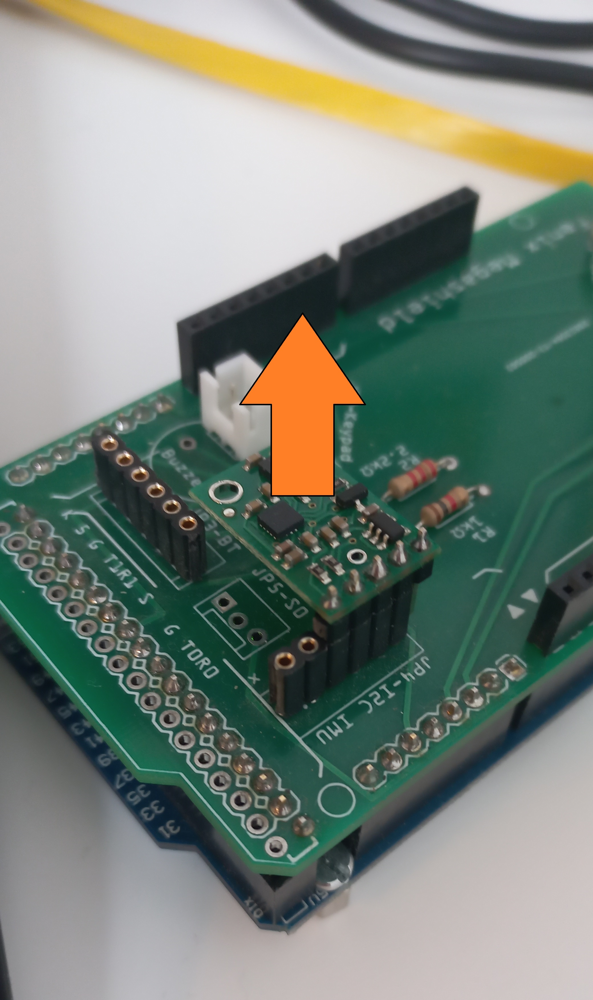

# Calibration of compass and actuator. Set up of Interfaces

## Introduction

This chapter explains how to calibrate your tiller pilot IMU and linear actuator.


These activities shall be performed through Bluetooth and Serial I/F and before installing Autopilot to the boat,


#### Connect Autopilot to different systems

* Connect Autopilot to Laptop/PC via serial terminal. Check PC/ Laptop Support Tools for help.
* Connect Autopilot to Fenix App via Bluetooth
* Connect Autopilot to a 12V source (battery or alternative) for linear actuator calibration

## Compass calibration


**Prerequisites:** Depending on the IMU device used, calibration procedure can change.

**Sparkfun IMU ICM20948:** This IMU has the best performance among all and is strongly recommended. For calibration, Fenix\_ICM\_20948\_Cal (Python application running on Windows/ Linux) is required.

_**Pololu MinIMU9V5**_ requires to start procedure with correct axis orientation. IMU Device components shall be on the top before starting Compass calibration. Connection to PC/ Laptop is recommended but not mandatory.

**Discontinued IMU after Fenix V3.3:**

_**BNO055 IMU Internal Sensor Fusion**_ nothing specific to be taken into account.

_**BNO055 IMU External Sensor Fusion**_ calibrates dynamically and do not require calibration.


Fenix autopilot is compatible with different types of IMU devices. Each has a different calibration procedure.

* Sparkfun IMU ICM20948: This IMU has the best performance among all and is strongly recommended. For calibration, Fenix\_ICM\_20948\_Cal (Python application running on Windows/ Linux) is required.
* Pololu MinIMU9V5. Has a good performance but less precisse and slower than ICM20948. Calibration of this IMU is very simple and can be done with Fenix App (mobile phone). If you don't have computer skills is a good alternative.
* Adafruit BNO055 is discontinued by the supplier and available units have demostrate low reliability. Is not supported by Fenix versions after V3.3.

## Calibration of Sparkfun IMU ICM20948

All the steps are performed on [Fenix\_ICM\_20948\_Cal.py](../annexes/fenix_icm_20948.md) application running and connected via Serial port (USB) to Fenix autopilot version ICM\_20948 (Sparkfun).

1. Connect Autopilot version ICM\_20948 (Sparkfun)
2. Press "Scan Serial Ports" to search for a COM port where Fenix is connected. Press "Connect".
3. "Press receive raw data from sensors". For each sensor a different procedure shall be followed to collect raw data. Raw data will be stored in files automatically.
   * G - Gyroscope: Keep sensor steady and accumulate some data (10 points should be enough). Close the graphics window.
   * A - Accelerometer: Turn sensor to different positions, keeping each steady for a few seconds. All moves shall be smooth to avoid drifting values. About 300 points should be enough.Close the graphics window.
   * M - Magnetometer: Turn sensor 360º to point at the different cardinal points. About 300 points should be enough. Close the graphics window.
4. Press "Calculate offsets". One graphics window per sensor will be opened with the raw data stored in the files. Close each window to generate the required offsets. A NMEA sentence per sensor will be stored in new files.
5. Press "Send offsets to autopilot". 3 NMEA sentences (1 per sensor) will be sent to Fenix autopilot.
6. Press "Save offsets sent to autopilot". Offsets will be permanently stored into Fenix autopilot.

## Calibration of Pololu MinIMU9V5

Start procedure with IMU components on top.

1. In Virtuino App, enter into Compass calibration screen and press Start Calibration button,

1. From Virtuino App, enter into Compass calibration mode.
2. To calibrate follow the steps:
3. Gyroscope and Accelerometer Calibration: Place the device in a single stable position, with device components on top, to allow the gyroscope and Accelerometer to calibrate. Keep this position for a period of few seconds until GYRO and ACC registers indicate fully calibrated.
4. Magnetometer Calibration: Make some random movements (for example: writing the number ‘8’ on air) until the MAG register indicates fully calibrated.
5. Verify Calibration: Autopilot will automatically exit Calibration mode after a reasonable time after calibration of each sensor. User shall make additional random movements to cover all different yaw, pitch and roll angles. Make smooth and fast movements. Make movements until MAG register is stable.

Calibration Verification result,

* [x] Calibration OK: Press "Save" button to store Compass calibration values for later use.
* [ ] Calibration KO: repeat Compass calibration process.

Once the compass is calibrated and values saved, the calibration profile will be reused to get the correct orientation data immediately after Power-on Autopilot.


Make sure that there is slow movement between 2 stable positions

The 6 stable positions could be in any direction, but make sure that the device is lying at least once perpendicular to the x, y and z axis.



Magnetometer in general are susceptible to both hard-iron and soft-iron distortions, but majority of the cases are rather due to the former. And the steps mentioned below are to calibrate the magnetometer for hard-iron distortions. Nevertheless certain precautions need to be taken into account during the positioning of the sensor to avoid unnecessary magnetic influences.


## Calibration of BNO055 IMU


Discontinued IMU: This information is available for Fenix V3.3. We highly recommend to evolve to alternative IMU devices as BNO055 has demostrated low performance.


_**BNO055 IMU Internal Sensor Fusion:**_ To calibrate follow the steps:

1. Gyroscope Calibration: Place the device in a single stable position to allow the gyroscope to calibrate. Keep this position for a period of few seconds until GYRO register indicates fully calibrated.
2. Accelerometer Calibration: Place the device in 6 different stable positions for a period of few seconds to allow the accelerometer to calibrate. Repeat until the ACC register indicates fully calibrated.
3. Magnetometer Calibration: Make some random movements (for example: writing the number ‘8’ on air) until the MAG register indicates fully calibrated.

_**BNO055 IMU Internal Sensor Fusion:**_ You can find below a Video tutorial by IMU BNO055 Manufacturer.



## Calibration of Linear Actuator

1. From Virtuino App, enter Linear actuator screen and press Start Calibration.

1. Press "Right Arrow" button extend linear actuator up to the complete extension of the linear actuator.
2. Press "Left Arrow" button to retract linear actuator up to the complete retraction of the linear actuator.
3. Press "Save" button to save linear actuator offsets
4. Exit calibration screen pressing "Tick" button.

## Configuration of OpenPlotter

### Configuration of Pypilot (Optional to use as external IMU)

Pypilot installed and calibrated

Select Only compass

Select Tab connections and create connection to Signal K as proposed.

Open Signal K server

Select Plugin Config

Enable plugin "Convert Signal K to NMEA0183". Enabled: YES

### Configuration of a new Serial I/F to Fenix Autopilot

Connect Fenix autopilot to an USB port

Open Serial application

* Serial Devices: /dev/ttyOP\_fenix
* data:NMEA0183

Apply Remember device

In the Connections tab, 2 serial connection are displayed, First from Device Fenix Autopilot and second from OpenCPN:

* Device /dev/ ttyACM0 alias /dev/: ttyOP\_fenix data:NMEA0183&#x20;
* Device /dev/ ttyACM0 alias /dev/: data:NMEA0183 Connection: OpenCPN bauds 960

## Configuration of OpenCPN within Openplotter

Set up additional data connections:

* Signal K (set up by default)
  * Priority: 4
* Serial I/O Protocol:&#x20;
  * NMEA 0183&#x20;
  * port: /dev/ttyACM0&#x20;
  * 4800 baud
  * Priority: 7
  * Select "Exit as autopilot or NMEA repeater"
  * Talker ID: EC
  * APB precision: x.xx.
  * Input filter: Accept only sentences: APHDM, APRSA, IIVWR, GP
  * Output filter: Transmit sentences: IIHDM, ECAPB, IIVWR
* Network I/O Protocol: TCP (Optional, to use Pypilot as external IMU).
  * Address: localhost
  * port: 10110
  * Select Exit as autopilot or NMEA repeater.
  * Talker ID: EC
  * APB precision: x.xx.&#x20;
  * Input filter: HDM, VWR
  * Output filter: Transmit sentences: IIHDM, IIVWR

