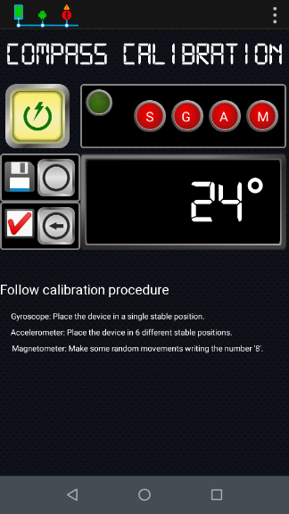
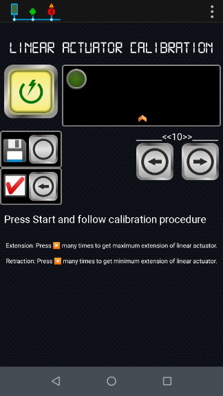
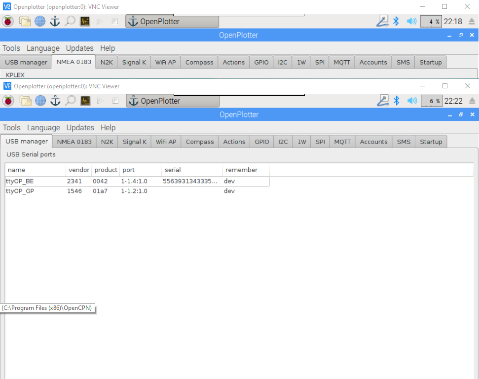
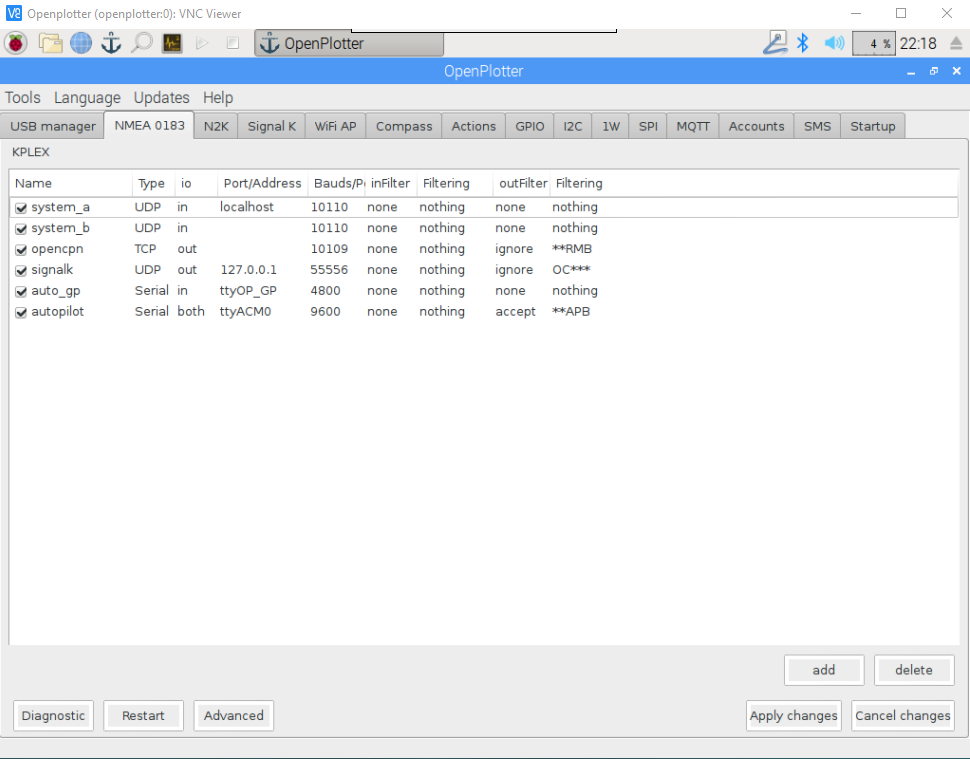
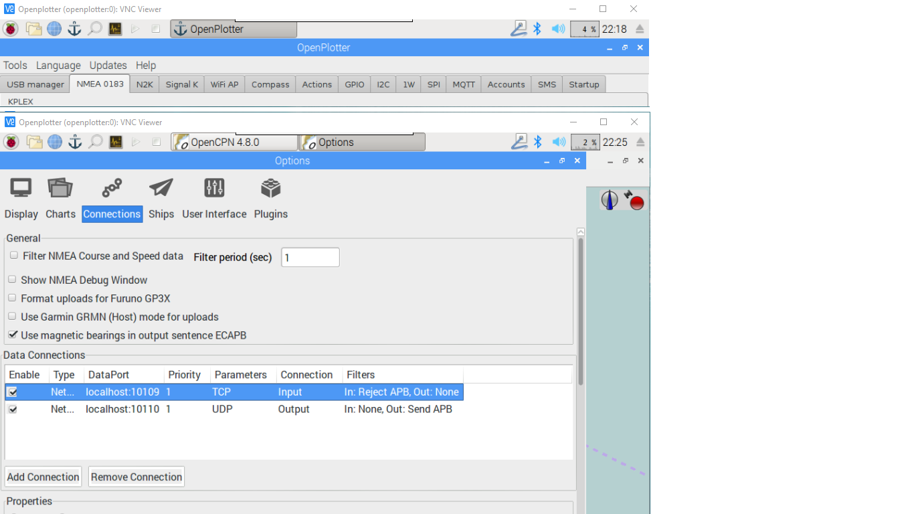
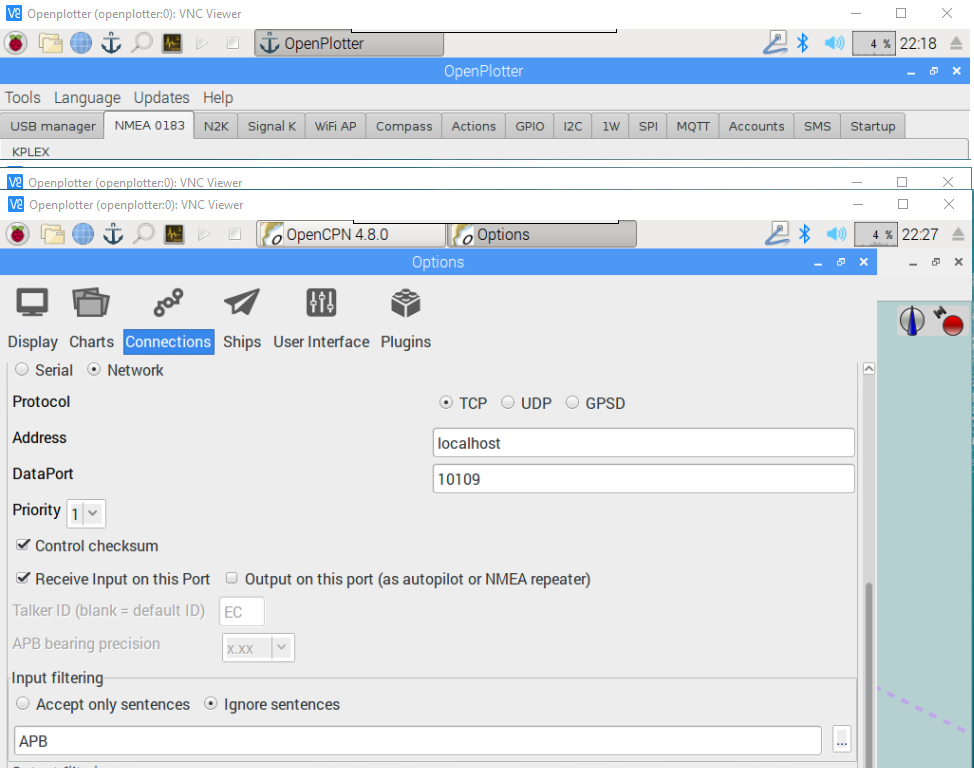
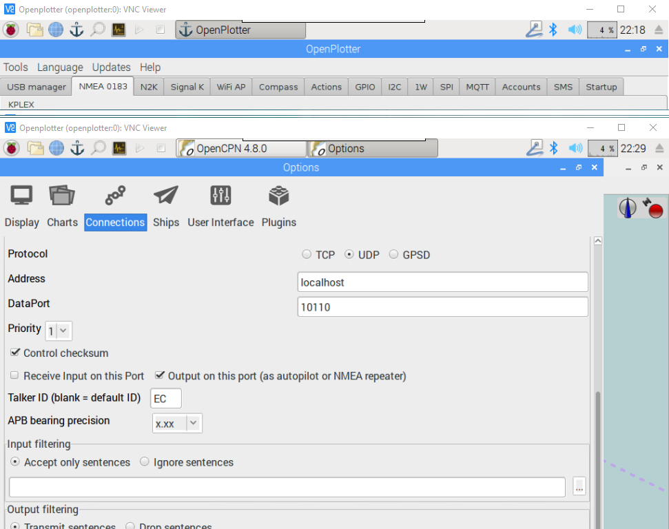

# Installation

## Installation Process

This chapter explains how to install your tiller pilot 

## Before Autopilot installation

These activities shall be performed through Serial I/F and before installing Autopilot into boat,

#### Connect Autopilot to PC/Laptop

* Install serial terminal 
* Connect Autopilot to Laptop/PC
* Connect Autopilot to a 12V source \(battery or alternative\)

### Compass calibration

1. In Virtuino App, enter into Compass calibration screen and press Start Calibration button,

1. From Virtuino App, enter into Compass calibration mode.
2. To calibrate BNO055 IMU sensor follow the steps:
   1. Gyroscope Calibration: Place the device in a single stable position to allow the gyroscope to calibrate. Keep this position for a period of few seconds until GYRO register indicates fully calibrated.
   2. Accelerometer Calibration: Place the device in 6 different stable positions for a period of few seconds to allow the accelerometer to calibrate. Repeat until 
   3. the ACC register indicates fully calibrated.
   4. Magnetometer Calibration: Make some random movements \(for example: writing the number ‘8’ on air\) until the MAG register indicates fully calibrated.
3. Verify Calibration: Autopilot will automatically exit Calibration mode after a reasonable time after calibration of each sensor. User shall make additional random movements to cover all different yaw, pitch and roll angles. Make smooth and fast movements. Make movements until MAG register is stable.

Calibration Verification result,

* [x] Calibration OK: Press "Save" button to store Compass calibration values for later use.
* [ ] Calibration KO: repeat Compass calibration process.

Once the compass is calibrated and values saved, the calibration profile will be reused to get the correct orientation data immediately after Power-on Autopilot.


Make sure that there is slow movement between 2 stable positions

The 6 stable positions could be in any direction, but make sure that the device is lying at least once perpendicular to the x, y and z axis.



Magnetometer in general are susceptible to both hard-iron and soft-iron distortions, but majority of the cases are rather due to the former. And the steps mentioned below are to calibrate the magnetometer for hard-iron distortions. Nevertheless certain precautions need to be taken into account during the positioning of the sensor to avoid unnecessary magnetic influences.


You can find below a Video tutorial by IMU BNO055 Manufacturer.



### Linear actuator calibration

1. From Virtuino App, enter Linear actuator screen and press Start Calibration.

1. Press "Right Arrow" button extend linear actuator up to the complete extension of the linear actuator.
2. Press "Left Arrow" button to retract linear actuator up to the complete retraction of the linear actuator.
3. Press "Save" button to save linear actuator offsets
4. Exit calibration screen pressing "Tick" button.

## Configuration of OpenPlotter

## Configuration of OpenCPN

