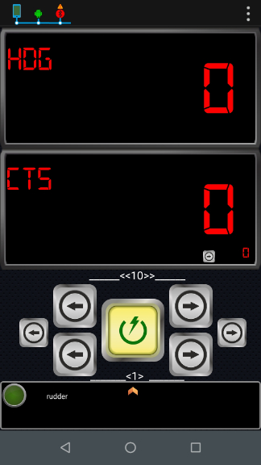
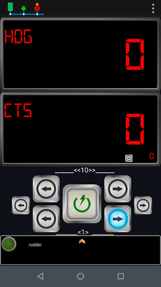
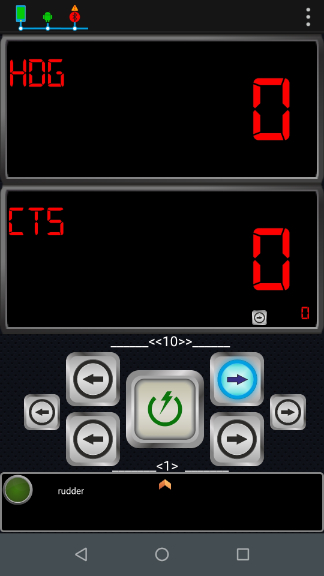
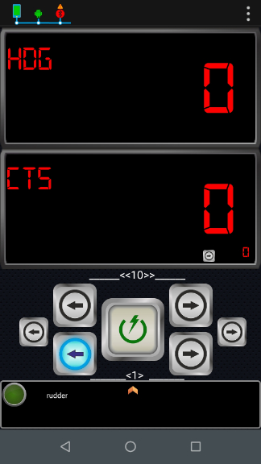
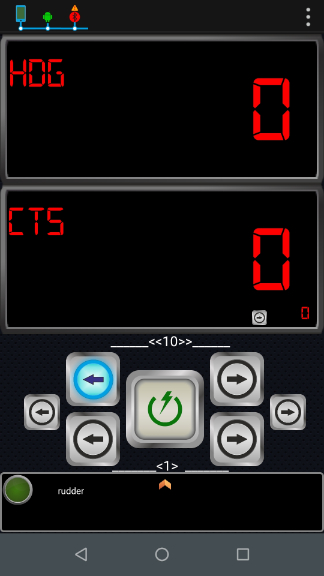
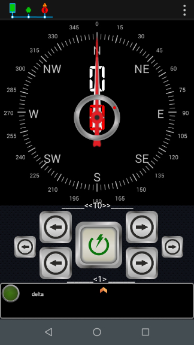
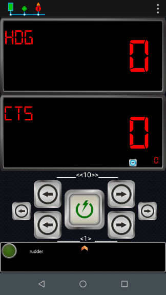
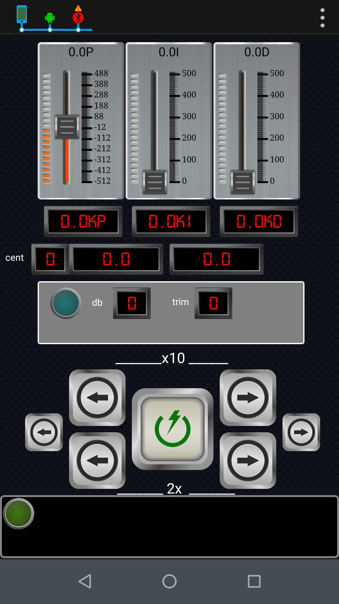

# User functions

## Change mode

### Switch working mode from STAND BY to AUTO

This function allows user to change Autopilot working mode from Stand-by to Auto alternatively.

* Executed in Stand-by mode, Autopilot will switch to Auto mode.
* Executed in Auto mode, Autopilot will switch to Stand-by mode.


`Initial CTS` value will be set to Heading value. This is useful for later execution of [Return to initial CTS](user-functions.md#return-to-initial-cts) function.


> #### Serial I/F $PEMC Code: 00
>
> Serial I/F Sentence: $PEMC,00\*37

### Enter into Track mode

#### Accept or Reject Autopilot action

Some actions require use confirmation before execution.

## Rudder control

This set of functions allows user to change rudder angle.


Rudder control functions are only available in Stand by mode.



Behaviour will be different depenting on the value of installation parameter`Installation Side` , startboard \(`S`\) or portboard \(`P`\).



In Fenix V0.1, the value of installation parameter`Installation Side` is always startboard \(`S`\)


> #### Serial I/F $PEMC Code: 01
>
> Serial I/F Sentence example: $PEMC,01,r\*68

### Increment Current Rudder by 1 Position Unit.

Perform a SHORT EXTENSION of the linear actuator to increase current rudder angle.

> Serial I/F Example: $PEMC,01,i\*xx

### Increment Current Rudder by 10 Position Unit.

Perform a LONG EXTENSION of the linear actuator to increase current rudder angle.

> Serial I/F Example: $PEMC,01,I\*xx

### Reduce Current Rudder by 1 Position Unit.

Perform a SHORT RETRACTION of the linear actuator to decrease current rudder angle.

> Serial I/F Example: $PEMC,01,r\*xx

### Reduce Current Rudder by 10 Position Unit.

Perform a LONG RETRACTION of the linear actuator to increase current rudder angle.

> Serial I/F Example: $PEMC,01,R\*xx

## Control Course to Steer

This set of functions allows user to change CTS angle.


If executed in Stand-by mode, Target CTS will be changed and will only take effect once autopilot is in Auto mode.


> #### Serial I/F $PEMC Code: 02
>
> Serial I/F Sentence example: $PEMC,02,i\*70

### Increment CTS by 1º

Increment CTS value in 1º

> Serial I/F Example: $PEMC,02,i\*xx

### Increment CTS by 10º

Increment CTS value in 10º

> Serial I/F Example: $PEMC,02,I\*xx

### Reduce CTS by 1º

Reduce CTS value in 1º

> Serial I/F Example: $PEMC,02,r\*xx

### Reduce CTS by 10º

Reduce CTS value in 10º

> Serial I/F Example: $PEMC,02,R\*xx

### Set CTS

Set CTS to a defined value.

### Return to initial CTS

Restore CTS to `Initial CTS` value.

## Autopilot monitoring

### Get Autopilot information

* Current Mode
* Current Rudder Position
* Heading Magnetic \(HDM\)
* Course To Steer \(CTS\)
* Deadband value
* Trimm

## Configuration control


Virtuino App provides limited funtionalities to manage autopilot configurations in Virtuino for Fenix App v0.1. 



Calibration of IMU and linear actuator must be performed before first use.



Autopilot provides initial default settings, however Installation and Gain Parameters might require customization to specific boat and installation conditions.


### Get Installation Parameters

To relinquish Autopilot current installation parameters.

> **Serial I/F $PEMC Code: 08**
>
> Serial I/F Sentence: $PEMC,08,I\*5A

* Centered Tiller Position
* Maximum rudder angle
* Average Cruise Speed
* Installation Side
* Rudder Damping
* Magnetic Variation
* Heading Alignment
* Off course alarm angle

### Set Installation Parameters

## Gain Parameters

Gain Parameters are,

* `Kp`
* `Ki`
* `Kd`
* `Sample Time`
* `Deadband type: Auto (A) , min (m), max (M)`

### Get current Gain Parameters

This function allows user to relinquish Autopilot current Autopilot Gain Parameters.

> **Serial I/F $PEMC Code: 08**
>
> Serial I/F Sentence: $PEMC,08,G\*54

Virtuino App V0.1 provides the following information,

* [x] Current weight of P, I, D factors in the overal PID output.
* [x] Current Gain parameters: KP, KI, KD
* [x] PID Error
* [x] PID Output
* [x] Deadband light: On if current Heading within deadband.
* [x] Deadband value

### Set new Gain Parameters

This function allows user to upload  a new set of Autopilot Gain Parameters.





## Save current Parameters

## Commissioning Functions


This funcions are only available in Stand-by mode


### Start compass calibration

This function allows user to calibrate internal IMU.

To calibrate BNO055 IMU sensor follow the steps:

* [x] Gyroscope Calibration: Place the device in a single stable position to allow the gyroscope to calibrate. Keep this position for a period of few seconds until GYRO register indicates fully calibrated.
* [x] Accelerometer Calibration: Place the device in 6 different stable positions for a period of few seconds to allow the accelerometer to calibrate. Repeat until 

  the ACC register indicates fully calibrated.


Make sure that there is slow movement between 2 stable positions

The 6 stable positions could be in any direction, but make sure that the device is lying at least once perpendicular to the x, y and z axis.


* [x] Magnetometer Calibration: Make some random movements \(for example: writing the number ‘8’ on air\) until the MAG register indicates fully calibrated.


Magnetometer in general are susceptible to both hard-iron and soft-iron distortions, but majority of the cases are rather due to the former. And the steps mentioned below are to calibrate the magnetometer for hard-iron distortions. Nevertheless certain precautions need to be taken into account during the positioning of the sensor to avoid unnecessary magnetic influences.


* [x] Verify Magnetometer calibration: Make additional random movements to cover all different yaw, pitch and roll angles. Make smooth and fast movements. Make movements until MAG register is stable.


Verify Magnetometer calibration step IS A MUST to ensure valid calibration values.


You can find below a Video tutorial by IMU BNO055 Manufacturer.



### Save compass offsets

Execute this function to save calibration values.

Once the compass is calibrated and values saved, the calibration profile will be reused to get the correct orientation data immediately after Power-on Autopilot.

### Start linear actuator calibration

### Save linear actuator offsets

