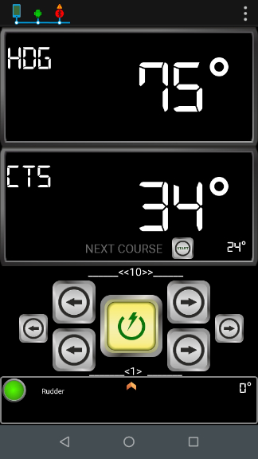
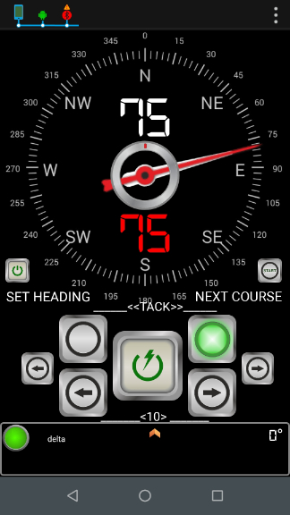
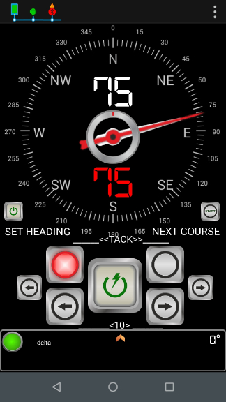
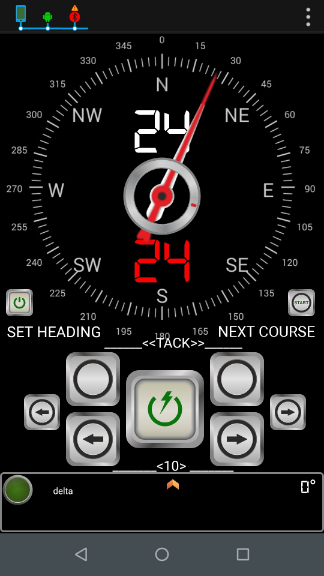
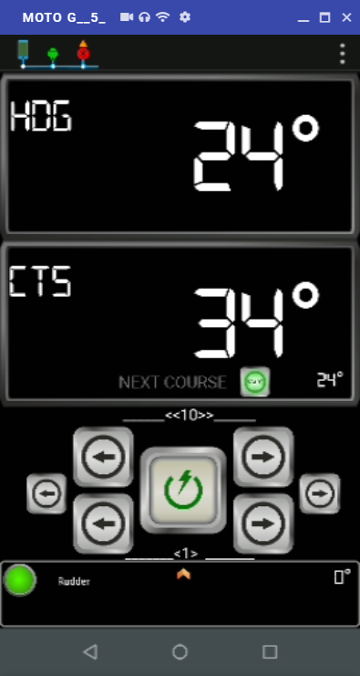
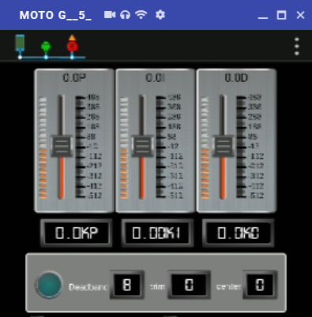
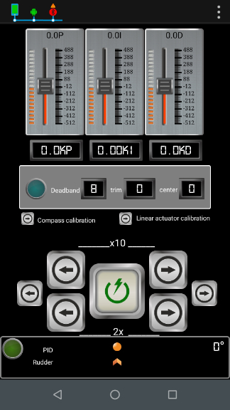

# User functions

## Change mode

### Switch working mode from STAND BY to AUTO

This function allows user to change Autopilot working mode from Stand-by to Auto or to disactivate Autopilot from any working mode:

* Executed in Stand-by mode, Autopilot will switch to Auto mode.
* Executed in Auto or Track mode, Autopilot will switch to Stand-by mode.

> #### Serial I/F $PEMC Code: 00
>
> Serial I/F Sentence: $PEMC,00\*37

## Rudder control

This set of functions allows user to change rudder angle.


Rudder control functions are only available in Stand by mode.



Behaviour will be different depenting on the value of installation parameter`Installation Side` , startboard \(`S`\) or portboard \(`P`\).



In Fenix V0.1, the value of installation parameter`Installation Side` is always startboard \(`S`\)


> #### Serial I/F $PEMC Code: 01
>
> Serial I/F Sentence example: $PEMC,01,r\*68

### Increment Current Rudder by 1 Position Unit.

Perform a SHORT EXTENSION of the linear actuator to increase current rudder angle.

In Virtuino App,

* In Stand by mode, press +1 button at Main page

> Serial I/F Example: $PEMC,01,i\*xx

### Increment Current Rudder by 10 Position Unit.

Perform a LONG EXTENSION of the linear actuator to increase current rudder angle.

In Virtuino App,

* In Stand by mode, press +10 button at Main page

> Serial I/F Example: $PEMC,01,I\*xx

### Reduce Current Rudder by 1 Position Unit.

Perform a SHORT RETRACTION of the linear actuator to decrease current rudder angle.

In Virtuino App,

* In Stand by mode, press -1 button at Main page

> Serial I/F Example: $PEMC,01,r\*xx

### Reduce Current Rudder by 10 Position Unit.

Perform a LONG RETRACTION of the linear actuator to increase current rudder angle.

In Virtuino App,

* In Stand by mode, press -10 button at Main page

> Serial I/F Example: $PEMC,01,R\*xx

## Control Course to Steer

This set of functions allows user to change Target CTS angle.

> #### Serial I/F $PEMC Code: 02
>
> Serial I/F Sentence example: $PEMC,02,i\*70

### Tacking Starboard

This function allows user to turn 100º to starboard, which is the standard value for tacking.

In Virtuino App,

* Press Tack-Starboard button at CTS page.

Next CTS will be updated, pending user confirmation.

* To start turn, press Next Course button.

### Tacking Portboard

This function allows user to turn 100º to portboard, which is the standard value for tacking.

In Virtuino App,

* Press Tack-Portboard button at CTS page.

Next CTS will be updated, pending user confirmation. Follow same procedure for Tacking Starboard.

### Increment CTS by 1º

This function allows user to Increment CTS value in 1º

In Virtuino App,

* Auto or Track mode, press +1 button at Main page

> Serial I/F Example: $PEMC,02,i\*xx

### Increment CTS by 10º

This function allows user to Increment CTS value in 10º

In Virtuino App,

* Auto or Track mode, 

press +10 button at Main page

* Stand-by, Auto or Track mode, 

In Virtuino App press +10 button at CTS page.

Then press Next Course button to accept new CTS.

> Serial I/F Example: $PEMC,02,I\*xx

### Reduce CTS by 1º

This function allows user to Reduce CTS value in 1º

In Virtuino App,

* Auto or Track mode, press -1 button at Main page
* Stand-by mode, press -1 button at CTS page. Press Next CTS button to Accept new CTS

> Serial I/F Example: $PEMC,02,r\*xx

### Reduce CTS by 10º

This function allows user to Reduce CTS value in 10º

In Virtuino App,

* Auto or Track mode, press -10 button at Main page
* Stand-by mode, press -10 button at CTS page. Press Next CTS button to Accept new CTS

> Serial I/F Example: $PEMC,02,R\*xx

### Set CTS

This function allows user to set Next CTS to a defined value.

Virtuino App,

* turn center wheel to point desired Target CTS at CTS page

### Activate Next Course to Steer

This function allows user to activate Target CTS. 

#### Activate Target CTS

Virtuino App in Main panel,

* in Auto mode,
* press NEXT COURSE button at Main page

Virtuino App,

* in CTS panel,
* Press Next CTS button to Accept Next CTS
* In Stand by mode, Auto mode will be activated.

#### Start Track Mode

In Virtuino App,

* When Track is available,
* Press Next Course button at Main page to accept new CTS.
* Autopilot will enter into Track mode.

## Autopilot monitoring

Autopilot operational status is defined by the following set of parameters,

* `Current Mode: Stand-by (S); Auto (A); Track (T)`
* `Current Rudder Position`
* `Heading Magnetic (HDM)`
* `Course To Steer (CTS) (Magnetic)`
* `Deadband value`
* `Trimm`


`Fenix V0.1 limitations:`

`Trimm` is not used.


### Get Autopilot information

This function allows user to relinquish Autopilot current operational status.

> **Serial I/F $PEMC Code: 08**
>
> Serial I/F Sentence: $PEMC,08,A\*52

Virtuino App V1.0 provides the following information at Main page,

* `Current Mode:` 
  * `Green light off: Stand-by (S)`
  * `Green light on: Auto (A) or Track (T)`
* `Rudder Position`
* `HDG: Heading Magnetic (HDM)`
* `Course To Steer (CTS) (Magnetic)`
* `Next Course To Steer (CTS) (Magnetic)`
* `Track Mode status`
* `Information, Warning and Error messages`

## Configuration control


Virtuino App provides limited funtionalities to manage autopilot configurations in Virtuino for Fenix App v1.0.



Calibration of IMU and linear actuator must be completed before first use.



Autopilot provides initial default settings, however Installation and Gain Parameters might require customization to specific boat and installation conditions.


## Installation Parameters

Installation Parameters are,

* `Centered Tiller Position`
* `Maximum rudder angle`
* `Average Cruise Speed`
* `Installation Side: Starboard (S) or Portboard (P)`
* `Rudder Damping`
* `Magnetic Variation`
* `Heading Alignment`
* `Off course alarm angle`

### Set Heading Alignment

This function allows user to set current heading.

In Virtuino App,

* Using an external compass as a valid referece, Set Next Course to current Heading value.
* In CTS panel, press Set Heading button.

Autopilot will update `Heading Alignment` value to the Next Course value.

### Get Installation Parameters

This function allows user to relinquish Autopilot current installation parameters.

> **Serial I/F $PEMC Code: 08**
>
> Serial I/F Sentence: $PEMC,08,I\*5A

Virtuino App V1.0 provides the following information at Gain page,

* `Deadband`

### Set Installation Parameters

This function allows user to upload  a new set of Installation Parameters.

> **Serial I/F $PEMC Code: 04**
>
> Serial I/F Example: $PEMC,04,2,40,4,S,3,4.1,33.9,9\*xx


Remember to save values for later use



Fenix V0.1 limitations: 

`Installation Side` cannot be changed. Always set to Starboard \(`S`\).

`Average Cruise Speed` is not used.


### Save current Installation Parameters

This function allows user to save current Installation Parameters and Linear actuator off-sets in the non-volatile memory for later use.

Once values are saved, will be reused immediately after Power-on Autopilot.

> **Serial I/F $PEMC Code: 11**
>
> Serial I/F Sentence: $PEMC,11,I\*52

## Gain Parameters

Gain Parameters are,

* `Kp`
* `Ki`
* `Kd`
* `Sample Time`
* `Deadband type: Auto (A) , min (m), max (M)`

### Get current Gain Parameters

This function allows user to relinquish Autopilot current Autopilot Gain Parameters.

> **Serial I/F $PEMC Code: 08**
>
> Serial I/F Sentence: $PEMC,08,G\*54

Virtuino App V1.0 provides the following information at Gain page,

* `Current weight of P, I, D factors in the overal PID output.` 
* `Current Gain parameters: KP, KI, KD PID` 
* `Target rudder (PID error)`
* `Deadband led: On if current Heading within deadband.` 
* `Deadband value`
* `Trim value`
* `Rudder Center deviation`

### Set Gain Parameters

This function allows user to upload  new set of Autopilot Gain Parameters.

> **Serial I/F $PEMC Code: 06**

> Serial I/F Example: $PEMC,06,3,0.11,0.7,1000,m\*xx


Remember to save values for later use


### Save current Gain Parameters

This function allows user to save current Gain Parameters in the non-volatile memory for later use.

Once values are saved, will be reused immediately after Power-on Autopilot.

> **Serial I/F $PEMC Code: 11**
>
> Serial I/F Sentence: $PEMC,11,G\*5C

## Commissioning Functions


These functions are only available in Stand-by mode


### Start compass calibration

This function allows user to enter into IMU calibration mode.

### Save compass offsets

This function allows user to save current IMU Calibration Off-sets in the non-volatile memory for later use. 

Once the compass is calibrated and values saved, the calibration profile will be reused to get the correct orientation data inmediately after Power-on Autopilot.

> **Serial I/F $PEMC Code: 11**
>
> Serial I/F Sentence: $PEMC,11,I\*52

### Enter/Exit linear actuator calibration mode

This function allows user to enter/ exit linear actuator calibration mode.

> **Serial I/F $PEMC Code: 10**
>
> Serial I/F Sentence: $PEMC,10\*36


Remember to save linear actuator off-sets for later use


