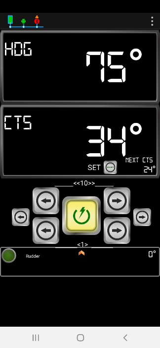
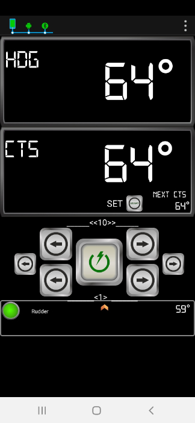
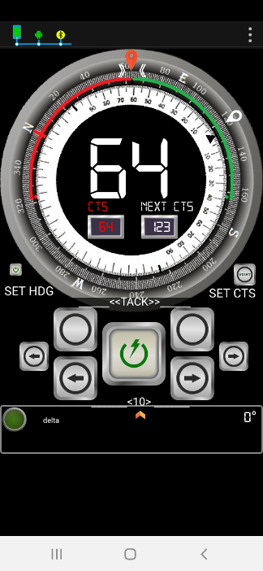
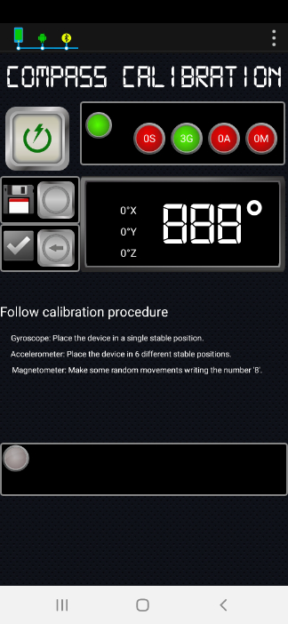

# User functions

## Change mode

### Switch working mode from STAND BY to AUTO

This function allows user to change Autopilot working mode from Stand-by to Auto or to disactivate Autopilot from any working mode:

* Executed in Stand-by mode, Autopilot will switch to Auto mode.
* Executed in Auto or Track mode, Autopilot will switch to Stand-by mode.

In Virtuino App,

* In Stand-by mode, press the Start/ Stop button at Main Page. Autopilot will enter into Auto mode.

* Autopilot will fix the course to steer \(CTS\) to current heading \(HDG\) value and Status Led will turn on.
* Autopilot will start moving the linear actuator to keep the boat course to CTS value.

* In Auto mode, press Start/ Stop button again to switch back to Stand-by mode. Autopilot will stop moving linear actuator.

> #### Serial I/F $PEMC Code: 00
>
> Serial I/F Sentence: $PEMC,00\*37

## Rudder control

This set of functions allows user to change rudder angle.


Rudder control functions are only available in Stand by mode.



Behaviour will be different depenting on the value of installation parameter`Installation Side` , startboard \(`S`\) or portboard \(`P`\).



In Fenix V2.0, the value of installation parameter`Installation Side` is always startboard \(`S`\)


> #### Serial I/F $PEMC Code: 01
>
> Serial I/F Sentence example: $PEMC,01,r\*68

### Increment Current Rudder by 1 Position Unit.

Perform a SHORT EXTENSION of the linear actuator to increase current rudder angle.

In Virtuino App,

* In Stand by mode, press +1 button at Main page

> Serial I/F Example: $PEMC,01,i\*xx

### Increment Current Rudder by 10 Position Unit.

Perform a LONG EXTENSION of the linear actuator to increase current rudder angle.

In Virtuino App,

* In Stand by mode, press +10 button at Main page

> Serial I/F Example: $PEMC,01,I\*xx

### Reduce Current Rudder by 1 Position Unit.

Perform a SHORT RETRACTION of the linear actuator to decrease current rudder angle.

In Virtuino App,

* In Stand by mode, press -1 button at Main page

> Serial I/F Example: $PEMC,01,r\*xx

### Reduce Current Rudder by 10 Position Unit.

Perform a LONG RETRACTION of the linear actuator to increase current rudder angle.

In Virtuino App,

* In Stand by mode, press -10 button at Main page

> Serial I/F Example: $PEMC,01,R\*xx

## Control Course to Steer

This set of functions allows user to change Target CTS angle.

> #### Serial I/F $PEMC Code: 02
>
> Serial I/F Sentence example: $PEMC,02,i\*70

### Tacking Starboard

This function allows user to select a 100º turn to starboard, which is the standard value for tacking. This turn requires a second user confirmation to avoid big turns are performed by mistake.

In Virtuino App,

* In Auto mode,

*  press Tack-Starboard button at CTS page. Next CTS value will be updated, pending user confirmation.

* To start the turn, [activate Next CTS ](user-functions.md#activate-next-course-to-steer-cts)pressing SET CTS button.

### Tacking Portboard

This function allows user to turn 100º to portboard, which is the standard value for tacking.

In Virtuino App,

* In Auto mode, press Tack-Portboard button at CTS page.
* Next CTS value will be updated, pending user confirmation.
* To start the turn, [activate Next CTS ](user-functions.md#activate-next-course-to-steer-cts)pressing SET CTS button.

### Increment CTS by 10º

This function allows user to Increment CTS value in 10º

In Virtuino App at Main panel,

* In Auto mode,  

* press +10 button. CTS will be increased by 10.

 

> Serial I/F Example: $PEMC,02,I\*xx

### Increment CTS by 1º

This function allows user to Increment CTS value in 1º

In Virtuino App, follow steps described previously

> Serial I/F Example: $PEMC,02,i\*xx

### Reduce CTS by 1º

This function allows user to Reduce CTS value in 1º

In Virtuino App,In Virtuino App, follow steps described previously

> Serial I/F Example: $PEMC,02,r\*xx

### Reduce CTS by 10º

This function allows user to Reduce CTS value in 10º

In Virtuino App, In Virtuino App, follow steps described previously

> Serial I/F Example: $PEMC,02,R\*xx

### Set Next Course To Steer \(CTS\)

This function allows user to set Next CTS to a defined value.

In Virtuino App,

* In Auto Mode at CTS panel,

* turn center wheel to point desired Target CTS

* When center wheel is released, Next CTS will be fixed, pending user confirmation.
* To [activate Next CTS ](user-functions.md#activate-next-course-to-steer-cts)press SET CTS button.

### Activate Next Course to Steer \(CTS\)

This function allows user to change CTS value to Next CTS. 

#### Activate Next CTS

In Virtuino App,

* at Main panel, in Auto mode 

* press SET button. CTS value will be set to NEXT CTS value.

Alternative, at CTS panel in Auto mode,

* Press SET CTS button and CTS value will be set to NEXT CTS value

#### Start Track Mode

In Virtuino App,

* When Track is available, TRACK AVAILABLE message is displayed,
* Press TRACK AVAILABLE button at Main page.
* Autopilot will enter into Track mode.

## Autopilot monitoring

Autopilot operational status is defined by the following set of parameters,

* `Current Mode: Stand-by (S); Auto (A); Track (T)`
* `Current Rudder Position`
* `Heading Magnetic (HDM)`
* `Course To Steer (CTS) (Magnetic)`
* `Deadband value`

### Get Autopilot information

This function allows user to relinquish Autopilot current operational status.

> **Serial I/F $PEMC Code: 08**
>
> Serial I/F Sentence: $PEMC,08,A\*52

Virtuino App V1.0 provides the following information at Main page,

* `Current Mode:` 
  * `Green light off: Stand-by (S)`
  * `Green light on: Auto (A) or Track (T)`
* `Rudder Position`
* `HDG: Heading Magnetic (HDM)`
* `Course To Steer (CTS) (Magnetic)`
* `Next Course To Steer (CTS) (Magnetic)`
* `Track Mode status`
* `Information, Warning and Error messages`

## Configuration control


Virtuino App provides minimum funtionalities to manage autopilot configurations for Fenix App v2.0.



Calibration of IMU and linear actuator must be completed before first use.



Autopilot provides initial default settings, however Installation and Gain Parameters might require customization to specific boat and installation conditions.


## Installation Parameters

Installation Parameters are,

* `Centered Tiller Position`
* `Maximum rudder angle`
* `Average Cruise Speed (Not used)`
* `Installation Side: Starboard (S) or Portboard (P)`
* `Rudder Damping`
* `Magnetic Variation`
* `Heading Alignment`
* `Off course alarm angle`

### Set Heading Alignment

This function allows user to adjust Autopilot compass HDG value to current boat heading.

In Virtuino App,

* In Stand by mode,

* Take a reference of current boat Heading with an external compass.
* In CTS panel, 
* Set NEXT CTS to referenced boat Heading value.

* press SET HDG button.

Autopilot will set`Heading Alignment` to NEXT CTS value.


Virtuino App will not save this value. Save Installation Parameters to retain the Heading Alignment value.


### Get Installation Parameters

This function allows user to relinquish Autopilot current installation parameters.

> **Serial I/F $PEMC Code: 08**
>
> Serial I/F Sentence: $PEMC,08,I\*5A

Virtuino App V1.0 provides the following information at Gain page,

* `Deadband`

### Set Installation Parameters

This function allows user to upload  a new set of Installation Parameters.

> **Serial I/F $PEMC Code: 04**
>
> Serial I/F Example: $PEMC,04,2,40,4,S,3,4.1,33.9,9\*xx


Remember to save values for later use



Fenix V2.0 limitations: 

`Installation Side` cannot be changed. Always set to Starboard \(`S`\).

`Average Cruise Speed` is not used.


### Save current Installation Parameters

This function allows user to save current Installation Parameters and Linear actuator off-sets in the non-volatile memory for later use.

Once values are saved, will be reused immediately after Power-on Autopilot.

> **Serial I/F $PEMC Code: 11**
>
> Serial I/F Sentence: $PEMC,11,I\*52

## Gain Parameters

Gain Parameters are,

* `Kp`
* `Ki`
* `Kd`
* `Sample Time`
* `Deadband type: Auto (A) , min (m), max (M)`

### Get current Gain Parameters

This function allows user to relinquish Autopilot current Autopilot Gain Parameters.

> **Serial I/F $PEMC Code: 08**
>
> Serial I/F Sentence: $PEMC,08,G\*54

Virtuino App V1.0 provides the following information at Gain page,

* `Current weight of P, I, D factors in the overal PID output.` 
* `Current Gain parameters: KP, KI, KD PID` 
* `Target rudder (PID error)`
* `Deadband led: On if current Heading within deadband.` 
* `Deadband value`
* `Trim value`
* `Rudder Center deviation`

### Set Gain Parameters

This function allows user to upload  new set of Autopilot Gain Parameters.

> **Serial I/F $PEMC Code: 06**

> Serial I/F Example: $PEMC,06,3,0.11,0.7,1000,m\*xx


Remember to save values for later use


### Save current Gain Parameters

This function allows user to save current Gain Parameters in the non-volatile memory for later use.

Once values are saved, will be reused immediately after Power-on Autopilot.

> **Serial I/F $PEMC Code: 11**
>
> Serial I/F Sentence: $PEMC,11,G\*5C

## Commissioning Functions


These functions are only available in Stand-by mode


### Start compass calibration

This function allows user to calibrate the internal compass \(IMU\).

* In Virtuino App, Stand-by mode,
* Access to Compass Calibration through Configuration panel,

* Press Start Button to launch the calibration process,

* Along calibration, the status of the different sensors will be displayed. Status 3 will represent a sensor fully calibrated.

Follow the calibration procedure described in the screen until all sensors are fully calibrated \(All green\).

You will have additional time to check X, Y, Z axes and bearing values. Once the time has expired, Save and Exit Buttons will be enabled again.

* Press Save Button.


Once the compass is calibrated and values saved, the calibration profile will be reused to get the correct orientation data inmediately after Power-on Autopilot.

If you are satified with the result of the calibration process, press Save Button to be used by the autopilot every time it is powered on.


> **Serial I/F $PEMC Code:** 
>
> **09 \(Start IMU Calibration Mode\)**
>
> > Serial I/F Sentence: $PEMC,09\*3E

> **11 \(Save IMU Calibration Values\)**
>
> Serial I/F Sentence: $PEMC,11,I\*52

### Enter/Exit linear actuator calibration mode

This function allows user to enter/ exit linear actuator calibration mode.

In Virtuino App, Stand-by mode,

* From Configuation Panel enter into Linear Actuator Calibration Panel,

* Press Start Button to launch the calibration process,

* Press Extend Button to extend the linear actuator as many times as required until the extension is complete.
* Press Retract Button to retract the linear actuator as many times as required until the retraction is complete.


Press the Save Button to save linear actuator off-sets for later use


> **Serial I/F $PEMC Code: 10**
>
> Serial I/F Sentence: $PEMC,10\*36

