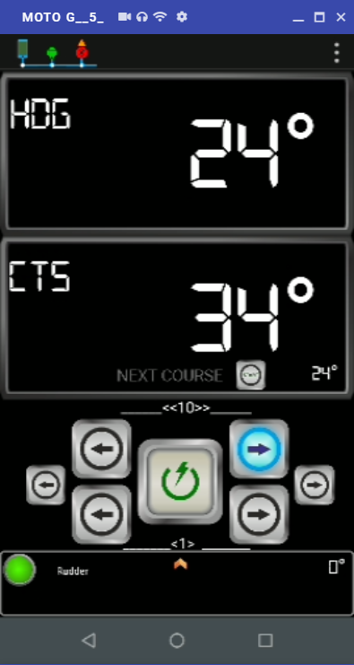
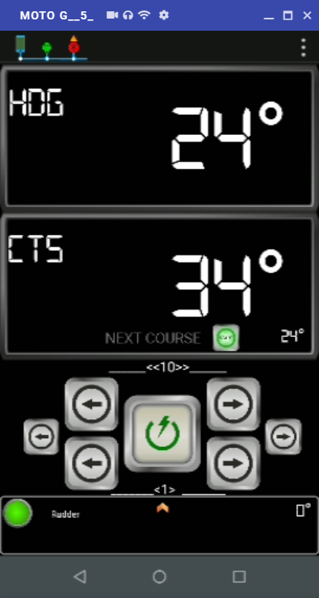
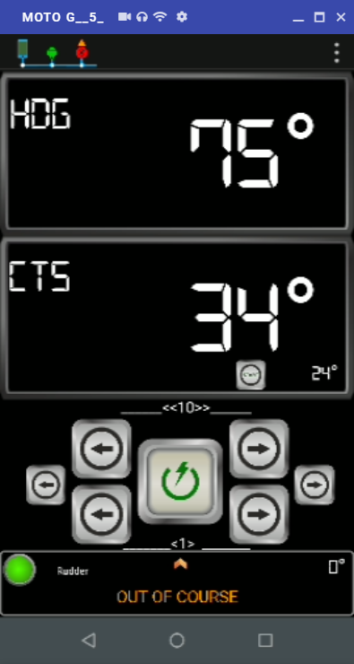
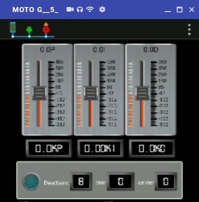

# Using Auto Mode

## Engaging the autopilot \(Auto mode\) 

1. Steady the boat on the required heading.
2. Place the pushrod over the tiller pin. If necessary, extend or retract the pushrod using [Rudder Control](user-functions.md#rudder-control). 
3. [Switch working mode from STAND BY to AUTO](user-functions.md#switch-working-mode-from-stand-by-to-auto): the tiller pilot will enter Auto mode. 

## Disengaging the autopilot \(Standby mode\) 

To return to hand steering:

1. [Switch working mode from AUTO to STAND BY](user-functions.md#switch-working-mode-from-stand-by-to-auto):  
2. Remove the pushrod from the tiller pin to return to hand steering.
3. The last heading is memorized and can be recalled \([Returning to previous Heading](using-auto-mode.md#returning-to-the-previous-heading)\)

## Changing course

In Auto mode, 

use [Control Course to Steer](user-functions.md#control-course-to-steer) to change course in steps of 1° and 10°.

For example: press -10 three times for a 30° course change to port:

## Automatic tack feature \(AutoTack\)


Feature not available in v.0.1


## Dodging obstacles

To avoid an obstacle when your boat is under autopilot control, 

1. select a course change in the appropriate direction. 

> For example,

When safely clear of the obstacle, you can either:

* [x] reverse the previous course change \(for example, by pressing -10 button to decreate CTS by 10º\), or
* [x] return to the previous heading \(see below\)

### Returning to the previous heading

1. Use [Return to initial CTS](user-functions.md#return-to-initial-cts)
2. CTS will change to initial value when Auto mode was selected.

## Off course alarm

The off course alarm sounds if the locked autopilot heading and the boat’s current heading differ by more than the value set in calibration  parameter `Off course alarm angle` \(see [Get Installation Parameters](user-functions.md#get-installation-parameters)\) for more than xx seconds. A Warning will be displayed in the Virtuino App.

### Cancelling the off course alarm

To cancel the off course alarm, 

1. [Switch working mode from AUTO to STAND BY](user-functions.md#switch-working-mode-from-stand-by-to-auto). 


Note: If the off course alarm sounds, this is usually an indication that the boat is carrying too much sail, or that the sails are badly balanced. In these conditions, you can usually obtain significant improvements in course keeping by improving the sail balance


## Automatic deadband control

When the tiller pilot is set to Auto Deadband, the pilot will gradually ignore repetitive movements of the boat and respond only to true course variations. 

By preventing unnecessary rudder movement, Auto Deadband provides the best compromise between power consumption and course keeping accuracy. 

If you want to switch off the Auto Deadband feature: 

1. From Stand by, Auto or Track mode, [Set new Autopilot gain](user-functions.md)  and change parameter  `Deadband Type` to switch from Auto \(`A`\) to Fixed Deadband:

* [x] Fixed Minimum Deadband \(`m`\): Minimum deadband provides the tightest course keeping possible, at the expense of increased power consumption and drive unit activity.
* [x] Fixed Maximum Deadband \(`M`\): Maximum deadband provides the loosest course keeping, maximizing power saving and minimizing drive unit activity.

To switch back to Auto Deadband, 

1. [Set new Autopilot gain](user-functions.md)  and change parameter  `Deadband Type` to Auto \(`A`\)

Current Deadband value can be monitored in Virtuino App, Configuration pannel. Blue led is on when heading is within current deadband.

