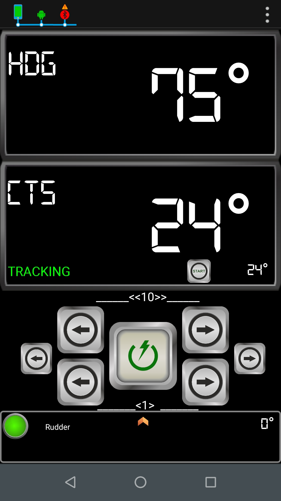
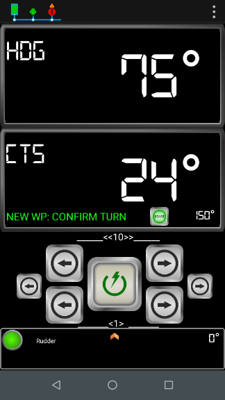

# Using Track Mode

In Track mode, the autopilot maintains a track between waypoints created on a navigation system. The autopilot receives any course changes to keep your boat on track. To operate in Track mode, the tiller pilot must receive APB information from either:

* OpenCPN, or
* any navigation system transmitting NMEA 0183 APB messages.

### Enter into Track mode

When Autopilot receives a track, displays TRACK AVAILABLE message and Next CTS points to the next Waypoint. In this situation, Track Mode is available.

#### Start Track Mode

In Virtuino App,

* Press Next Course button at Main page to accept Next CTS.

* Autopilot will enter into Track Mode. CTS will be automatically updated following Track information received from Navigation system.

#### Select Next Waypoint

In Track mode, when boat has arrived to the active Waypoint, Navigation system will start sending information related to the next Waypoint in the track.

When Autopilot receives next Waypoint information , displays NEW WP message and Next CTS points to the next Waypoint in the track.&#x20;

In this situation, user has to Confirm Turn to continue in Track Mode.

In Virtuino App,

* When NEW WP is displayed, Press Next Course button at Main page to accept new CTS.

