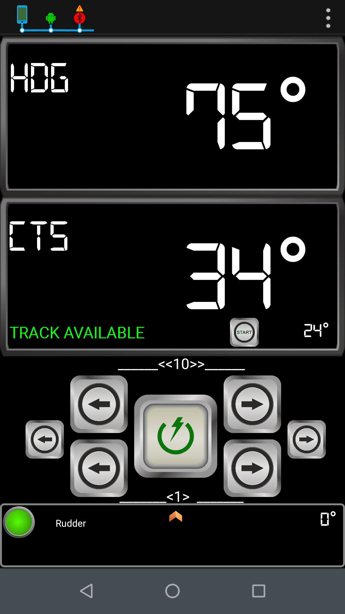

# Using Track Mode

In Track mode, the autopilot maintains a track between waypoints created on a navigation system. The autopilot receives any course changes to keep your boat on track. To operate in Track mode, the tiller pilot must receive APB information from either:

* OpenCPN, or
* any navigation system transmitting NMEA 0183 APB messages.

### Enter into Track mode

When Autopilot receives a track, displays TRACK AVAILABLE message and bearing angle to the next waypoint. In this situation, Track Mode is available.

#### Start Track Mode

In Virtuino App,

* Press Next Course button at Main page to accept new CTS.

## 

